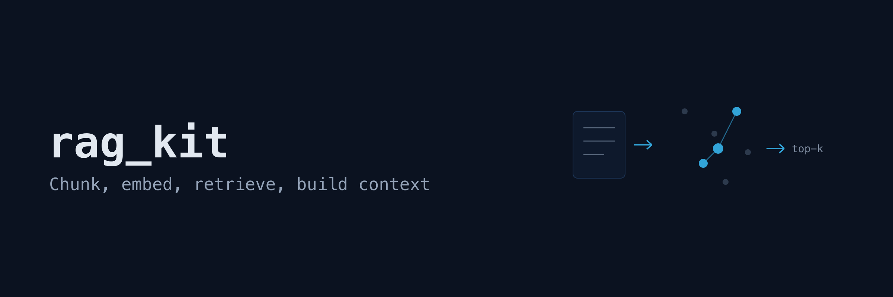
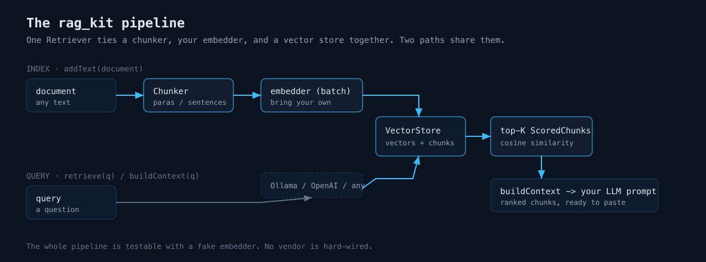

# rag_kit



Retrieval-augmented generation for Dart: chunking, embeddings, vector
search, and context building. Bring your own embedding model.

pub.dev has embedding API clients and it has vector database clients, but
the wiring between them is left to you every time: split documents into
chunks, embed them in batches, store the vectors, search them, and paste
the best matches into a prompt. rag_kit is that wiring as a small, pure
Dart package with no runtime dependencies.

The package does not call any model itself. You pass a single function
that turns a batch of texts into vectors, and everything else works with
it. That keeps the package independent of any provider SDK and makes the
whole pipeline testable with a fake embedder.



## Quick start

```dart
import 'package:rag_kit/rag_kit.dart';

Future<void> main() async {
  final retriever = Retriever(
    embedder: myEmbedder, // your function, see bindings below
    store: InMemoryVectorStore(),
    chunker: Chunker.paragraphs(),
  );

  // Chunks the text, embeds all chunks in one batch, stores them.
  await retriever.addText(documentText, sourceId: 'handbook');

  // Embeds the query and returns the most similar chunks.
  final results = await retriever.retrieve('how do I request leave?');
  for (final r in results) {
    print('${r.score.toStringAsFixed(3)} ${r.document.id}');
  }

  // Or get a ready-to-paste prompt context, capped at 4000 characters.
  final context = await retriever.buildContext(
    'how do I request leave?',
    maxChars: 4000,
  );
}
```

A runnable version with a self-contained fake embedder is in
`example/rag_kit_example.dart`.

## The embedder contract

```dart
typedef Embedder = Future<List<List<double>>> Function(List<String> texts);
```

The function receives the whole batch in one call, so an HTTP-backed
embedder sends one request per document instead of one request per chunk.
Return exactly one vector per input text, in input order.

### Ollama binding

Uses only `dart:io`, no extra dependencies. Requires a running Ollama with
an embedding model pulled, for example `ollama pull nomic-embed-text`.

```dart
import 'dart:convert';
import 'dart:io';

Future<List<List<double>>> ollamaEmbedder(List<String> texts) async {
  final client = HttpClient();
  try {
    final request = await client.post('localhost', 11434, '/api/embed');
    request.headers.contentType = ContentType.json;
    request.write(jsonEncode({'model': 'nomic-embed-text', 'input': texts}));
    final response = await request.close();
    final body = await response.transform(utf8.decoder).join();
    if (response.statusCode != 200) {
      throw HttpException('Ollama: ${response.statusCode} $body');
    }
    final decoded = jsonDecode(body) as Map<String, dynamic>;
    return [
      for (final e in decoded['embeddings'] as List)
        [for (final v in e as List) (v as num).toDouble()],
    ];
  } finally {
    client.close(force: true);
  }
}
```

### OpenAI binding

Same shape against the OpenAI embeddings endpoint. Also works with any
OpenAI-compatible server.

```dart
import 'dart:convert';
import 'dart:io';

Future<List<List<double>>> openAiEmbedder(List<String> texts) async {
  final client = HttpClient();
  try {
    final request = await client.postUrl(
      Uri.parse('https://api.openai.com/v1/embeddings'),
    );
    request.headers.contentType = ContentType.json;
    request.headers.set(
      'Authorization',
      'Bearer ${Platform.environment['OPENAI_API_KEY']}',
    );
    request.write(
      jsonEncode({'model': 'text-embedding-3-small', 'input': texts}),
    );
    final response = await request.close();
    final body = await response.transform(utf8.decoder).join();
    if (response.statusCode != 200) {
      throw HttpException('OpenAI: ${response.statusCode} $body');
    }
    final decoded = jsonDecode(body) as Map<String, dynamic>;
    return [
      for (final item in decoded['data'] as List)
        [
          for (final v in (item as Map)['embedding'] as List)
            (v as num).toDouble(),
        ],
    ];
  } finally {
    client.close(force: true);
  }
}
```

## Chunkers

All chunkers report exact source offsets: for every chunk,
`source.substring(chunk.start, chunk.end) == chunk.text`, so you can
highlight retrieved passages in the original document.

| Chunker | Strategy |
|---|---|
| `Chunker.fixed(maxChars: 1000, overlap: 200)` | Character windows snapped to word boundaries, with overlapping edges. |
| `Chunker.paragraphs(maxChars: 2000)` | Splits on blank lines. Oversized paragraphs fall back to fixed windows. |
| `Chunker.sentences(maxChars: 1000, overlap: 1)` | Packs whole sentences per chunk; overlap is counted in sentences. |

The sentence splitter is intentionally simple: it splits on `.`, `!`, or
`?` followed by whitespace and knows nothing about abbreviations, so
"e.g. this" splits after "e.g.". If your text is dense with abbreviations,
use `Chunker.paragraphs` or implement your own `Chunker`.

## Vector store

`InMemoryVectorStore` stores embeddings as float32 (half the memory of
doubles), precomputes each vector's norm at insert time, and scores
candidates with cosine similarity using one dot product per document.
Top-k selection uses a bounded min-heap rather than sorting all
candidates. Searches support `topK`, `minScore`, and a metadata `where`
filter.

Search is exact, not approximate: every stored vector is scored on every
query. That is the honest trade-off of this release. Exact search is
deterministic and has no index build cost. Measured medians with 768-dim
embeddings and `topK: 5` on an Apple M-series laptop: about 5 ms per
query at 10k chunks, about 50 ms at 100k. Beyond that scale you want an
ANN index, which is on the roadmap below.

The `VectorStore` interface is asynchronous and small (`upsert`, `search`,
`removeWhere`, `count`, `clear`), so a database-backed implementation can
be dropped in without touching the rest of the pipeline.

## Persistence and the web

The core library `package:rag_kit/rag_kit.dart` is platform-neutral and
runs on the web. File persistence lives in `package:rag_kit/io.dart`,
which re-exports the core library and adds:

```dart
import 'package:rag_kit/io.dart';

await store.save('index.bin');
final store = await InMemoryVectorStoreFiles.load('index.bin');
```

On the web, serialize with `store.toBytes()` and restore with
`InMemoryVectorStore.fromBytes(bytes)`, persisting the bytes wherever you
like, for example IndexedDB.

The file format is a compact binary layout, not JSON. All integers and
floats are little-endian:

```text
bytes 0-3    magic "RGK1"
bytes 4-7    embedding dimension, uint32
bytes 8-11   document count, uint32
per document:
  uint32 byte length + UTF-8 bytes   id
  uint32 byte length + UTF-8 bytes   text
  uint32 byte length + UTF-8 bytes   metadata as JSON
  dimension x 4 bytes                embedding as float32
```

Corrupt or truncated files fail with a `FormatException`; there is no
checksum, so single flipped bits inside embedding data are not detected.
The magic bytes version the format: a future incompatible layout will use
a different magic and this release will reject it cleanly. Document
metadata must be JSON-encodable for saving.

## Limits

- Exact search only. Practical up to roughly 100k chunks; see above.
- The whole store lives in memory. A 100k-chunk store with 768-dim
  embeddings takes about 300 MB as float32.
- The sentence splitter has no abbreviation handling.
- Embeddings are stored as float32; components differ from the original
  doubles by float32 rounding error, which does not affect ranking in
  practice.

## Planned

- HNSW or another ANN index for larger corpora.
- Reranking hooks.
- PDF and HTML loaders.
- Embedding quantization.
- A checksum in the persistence format.

## License

MIT
