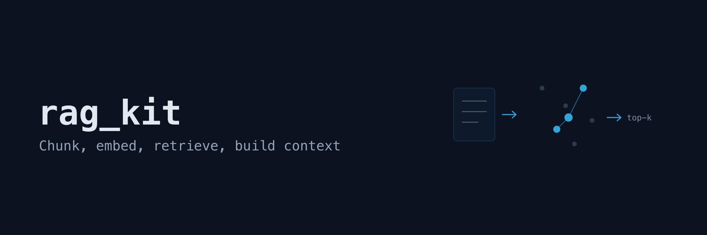
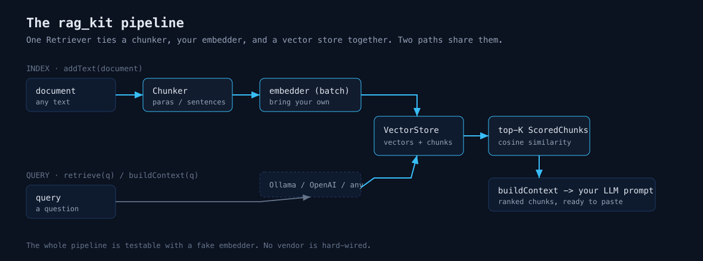

# rag_kit



Retrieval-augmented generation for Dart: chunking, embeddings, vector
search, and context building. Bring your own embedding model.


## Why this instead of what you already have

**Instead of wiring it yourself.** Splitting text, batching an embedder, and
scoring cosine similarity are each short enough to hand-write. The selection
step is not. `Retriever.retrieveDiverse` (`lib/src/retriever.dart:148`) pulls a
candidate pool four times `topK` and runs maximal marginal relevance over it
(`lib/src/retriever.dart:193`), so three copies of the same paragraph do not
take three of your five context slots.

**Instead of `langchain`.** langchain_dart is the large, maintained incumbent
here, and its `MemoryVectorStore` does filter by metadata before scoring. Then
it sorts by similarity and takes `k` (`lib/src/vector_stores/memory.dart:169`),
and that is the whole selection. Grep the package for `mmr`, `maximal marginal`,
or `diversity`: no hits anywhere, README included, so near-duplicate results are
still yours to deal with. It also brings six runtime dependencies
(`langchain_core`, `uuid`, `collection`, `crypto`, `characters`, `meta`).
rag_kit has none.

**Reach for it when**

- You want retrieval on-device or in a Dart backend without adding a vector
  database to the deployment.
- Your sources repeat themselves, so the top matches keep being the same
  sentence three times over.
- You want the pipeline testable against a fake embedder instead of a live API
  key.

Skip it if your vectors already live in pgvector or a hosted index, because then
the store is the piece you have and what is left here is a chunker and one
selection loop.

pub.dev has embedding API clients and it has vector database clients, but
the wiring between them is left to you every time: split documents into
chunks, embed them in batches, store the vectors, search them, and paste
the best matches into a prompt. rag_kit is that wiring as a small, pure
Dart package with no runtime dependencies.

The package does not call any model itself. You pass a single function
that turns a batch of texts into vectors, and everything else works with
it. That keeps the package independent of any provider SDK and makes the
whole pipeline testable with a fake embedder.



## Quick start

```dart
import 'package:rag_kit/rag_kit.dart';

Future<void> main() async {
  final retriever = Retriever(
    embedder: myEmbedder, // your function, see bindings below
    store: InMemoryVectorStore(),
    chunker: Chunker.paragraphs(),
  );

  // Chunks the text, embeds all chunks in one batch, stores them.
  await retriever.addText(documentText, sourceId: 'handbook');

  // Embeds the query and returns the most similar chunks.
  final results = await retriever.retrieve('how do I request leave?');
  for (final r in results) {
    print('${r.score.toStringAsFixed(3)} ${r.document.id}');
  }

  // Or get a ready-to-paste prompt context, capped at 4000 characters.
  final context = await retriever.buildContext(
    'how do I request leave?',
    maxChars: 4000,
  );

  // Scope a query with a metadata filter: only chunks whose document metadata
  // matches are scored. Restrict to one source, language or tenant.
  final scoped = await retriever.retrieve(
    'how do I request leave?',
    where: (doc) => doc.metadata['sourceId'] == 'handbook',
  );
}
```

`retrieve` and `buildContext` both take `minScore` and a `where` predicate,
forwarded to the store: filtering costs no similarity computation on the
documents it excludes.

## Diverse retrieval

Similarity alone has a failure mode that shows up on any repetitive source. If
a handbook says the same thing in three places, the three most similar chunks
are near-copies of each other, so the context window pays for one fact three
times while the fact that would have answered the question sits just below the
cut.


Both columns come from one call each: same query, same handbook, same `topK`.
The paragraph carrying the two-week notice rule ranks fourth by similarity,
which is why the left column never reaches it, and the number under each column
is the highest cosine between two of that column's own picks.
`dart run tool/diverse_retrieval_figure.dart` measures the run and draws it, and
refuses to write the file when the claim stops holding.

`retrieveDiverse` runs maximal marginal relevance over a larger candidate pool,
choosing each next chunk for how relevant it is minus how much it repeats what
is already chosen:

```dart
final results = await retriever.retrieveDiverse(
  'how do I request leave?',
  topK: 5,
  lambda: 0.5, // 1.0 is pure relevance, 0.0 is pure diversity
);

// Or straight into a prompt:
final context = await retriever.buildContext(
  'how do I request leave?',
  maxChars: 4000,
  diverse: true,
);
```

`fetchK` is the pool pulled by similarity before the selection runs, four times
`topK` by default, since the selection can only choose among what it is handed.
Results keep their query-similarity score and come back most relevant first,
the same as `retrieve`'s. `minScore` and `where` work the same.

## Citing sources

By default `buildContext` joins the raw chunk texts, which leaves the model no
way to say which document a passage came from. Pass a `label` to prefix each
chunk with a source marker; it counts against `maxChars` like the rest of the
chunk, and left off the output is exactly the joined texts.

```dart
final context = await retriever.buildContext(
  'how do I request leave?',
  maxChars: 4000,
  label: (c) => '[${c.document.metadata['sourceId']}]',
);
// [handbook]
// You request leave through the HR portal...
```

The label receives the `ScoredChunk` and can read `document.id`,
`document.metadata`, or the `score`. Ask the model to keep the markers in its
answer and you get citations back.

A runnable version with a self-contained fake embedder is in
`example/rag_kit_example.dart`.

## The embedder contract

```dart
typedef Embedder = Future<List<List<double>>> Function(List<String> texts);
```

The function receives the whole batch in one call, so an HTTP-backed
embedder sends one request per document instead of one request per chunk.
Return exactly one vector per input text, in input order.

### Ollama binding

Uses only `dart:io`, no extra dependencies. Requires a running Ollama with
an embedding model pulled, for example `ollama pull nomic-embed-text`.

```dart
import 'dart:convert';
import 'dart:io';

Future<List<List<double>>> ollamaEmbedder(List<String> texts) async {
  final client = HttpClient();
  try {
    final request = await client.post('localhost', 11434, '/api/embed');
    request.headers.contentType = ContentType.json;
    request.write(jsonEncode({'model': 'nomic-embed-text', 'input': texts}));
    final response = await request.close();
    final body = await response.transform(utf8.decoder).join();
    if (response.statusCode != 200) {
      throw HttpException('Ollama: ${response.statusCode} $body');
    }
    final decoded = jsonDecode(body) as Map<String, dynamic>;
    return [
      for (final e in decoded['embeddings'] as List)
        [for (final v in e as List) (v as num).toDouble()],
    ];
  } finally {
    client.close(force: true);
  }
}
```

### OpenAI binding

Same shape against the OpenAI embeddings endpoint. Also works with any
OpenAI-compatible server.

```dart
import 'dart:convert';
import 'dart:io';

Future<List<List<double>>> openAiEmbedder(List<String> texts) async {
  final client = HttpClient();
  try {
    final request = await client.postUrl(
      Uri.parse('https://api.openai.com/v1/embeddings'),
    );
    request.headers.contentType = ContentType.json;
    request.headers.set(
      'Authorization',
      'Bearer ${Platform.environment['OPENAI_API_KEY']}',
    );
    request.write(
      jsonEncode({'model': 'text-embedding-3-small', 'input': texts}),
    );
    final response = await request.close();
    final body = await response.transform(utf8.decoder).join();
    if (response.statusCode != 200) {
      throw HttpException('OpenAI: ${response.statusCode} $body');
    }
    final decoded = jsonDecode(body) as Map<String, dynamic>;
    return [
      for (final item in decoded['data'] as List)
        [
          for (final v in (item as Map)['embedding'] as List)
            (v as num).toDouble(),
        ],
    ];
  } finally {
    client.close(force: true);
  }
}
```

## Chunkers

All chunkers report exact source offsets: for every chunk,
`source.substring(chunk.start, chunk.end) == chunk.text`, so you can
highlight retrieved passages in the original document.

| Chunker | Strategy |
|---|---|
| `Chunker.fixed(maxChars: 1000, overlap: 200)` | Character windows snapped to word boundaries, with overlapping edges. |
| `Chunker.paragraphs(maxChars: 2000)` | Splits on blank lines. Oversized paragraphs fall back to fixed windows. |
| `Chunker.sentences(maxChars: 1000, overlap: 1)` | Packs whole sentences per chunk; overlap is counted in sentences. |

The sentence splitter is intentionally simple: it splits on `.`, `!`, or
`?` followed by whitespace and knows nothing about abbreviations, which
makes "e.g. this" split after "e.g.". If your text is dense with abbreviations,
use `Chunker.paragraphs` or implement your own `Chunker`.

## Vector store

`InMemoryVectorStore` stores embeddings as float32 (half the memory of
doubles), precomputes each vector's norm at insert time, and scores
candidates with cosine similarity using one dot product per document.
Top-k selection uses a bounded min-heap rather than sorting all
candidates. Searches support `topK`, `minScore`, and a metadata `where`
filter.

Search is exact rather than approximate: every stored vector is scored on every
query. That is the honest trade-off of this release. Exact search is
deterministic and has no index build cost. Measured medians with 768-dim
embeddings and `topK: 5` on an Apple M-series laptop: about 5 ms per
query at 10k chunks, about 50 ms at 100k. Beyond that scale you want an
ANN index, which is on the roadmap below.

The `VectorStore` interface is asynchronous and small (`upsert`, `search`,
`removeWhere`, `count`, `clear`). A database-backed implementation can be
dropped in without touching the rest of the pipeline.

## Persistence and the web

The core library `package:rag_kit/rag_kit.dart` is platform-neutral and
runs on the web. File persistence lives in `package:rag_kit/io.dart`,
which re-exports the core library and adds:

```dart
import 'package:rag_kit/io.dart';

await store.save('index.bin');
final store = await InMemoryVectorStoreFiles.load('index.bin');
```

On the web, serialize with `store.toBytes()` and restore with
`InMemoryVectorStore.fromBytes(bytes)`, persisting the bytes wherever you
like, for example IndexedDB.

The file format is a compact binary layout, not JSON. All integers and
floats are little-endian:

```text
bytes 0-3    magic "RGK1"
bytes 4-7    embedding dimension, uint32
bytes 8-11   document count, uint32
per document:
  uint32 byte length + UTF-8 bytes   id
  uint32 byte length + UTF-8 bytes   text
  uint32 byte length + UTF-8 bytes   metadata as JSON
  dimension x 4 bytes                embedding as float32
```

Corrupt or truncated files fail with a `FormatException`. There is no
checksum: single flipped bits inside embedding data are not detected.
The magic bytes version the format: a future incompatible layout will use
a different magic and this release will reject it cleanly. Document
metadata must be JSON-encodable for saving.

## Composing with other packages

`Chunker` and `VectorStore` are interfaces so the two parts most worth
swapping can be swapped. `rag_kit` itself stays dependency-free; the pieces
below live in examples, and nothing here reaches your `pubspec` unless you want
it to.

| Instead of | Use | Why | Where it runs |
| --- | --- | --- | --- |
| `InMemoryVectorStore` | [`vector_kit`](https://pub.dev/packages/vector_kit) | Rows packed into one aligned `Float32List` with cached norms, read through `Float32x4` on the VM: one SIMD dot product per row instead of a scalar loop | Everywhere: pure Dart, no dependencies |
| `Chunker.fixed` | [`hf_tokenizers`](https://pub.dev/packages/hf_tokenizers) | Cuts on **tokens**, the unit the embedding model actually counts, instead of characters | Linux, macOS, Windows (it is FFI) |

`example/with_vector_kit.dart` is a complete `VectorStore` on top of
`VectorMatrix.topKCosine`, filters and all. The token chunker lives in
`hf_tokenizers`' own examples as `example/rag_chunking.dart`, so the FFI
dependency stays on that side.

Why the second row matters, measured on one mixed-script paragraph with a
24-token budget: the chunks it produced ran between **2.2 and 4.8 characters
per token**. No single `maxChars` is correct across that range, which is what
the note on `Chunker.fixed` has always said; this is the way to stop guessing.

## Limits

- Exact search only. Practical up to roughly 100k chunks; see above.
- The whole store lives in memory. A 100k-chunk store with 768-dim
  embeddings takes about 300 MB as float32.
- The sentence splitter has no abbreviation handling.
- Embeddings are stored as float32; components differ from the original
  doubles by float32 rounding error, which does not affect ranking in
  practice.

## Planned

- HNSW or another ANN index for larger corpora.
- Reranking hooks (a cross-encoder pass over the retrieved set).
- PDF and HTML loaders.
- Embedding quantization.
- A checksum in the persistence format.

## License

MIT
